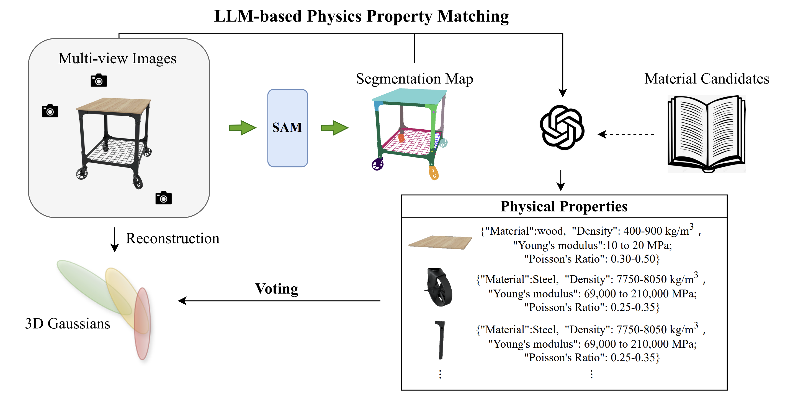
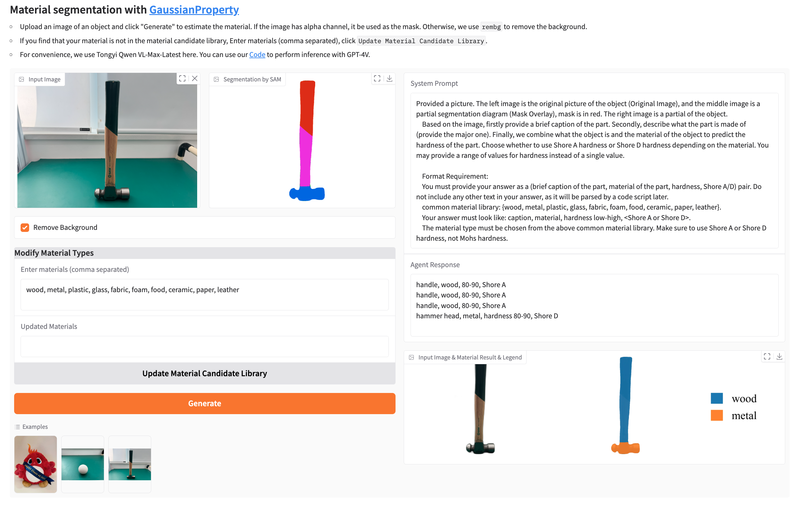

<div align="center">


# GaussianProperty: Integrating Physical Properties to 3D Gaussians with LMMs
<div style="display: grid; place-items: center;">

</div>


<a href="https://Gaussian-Property.github.io"></a>
<a href="https://arxiv.org/abs/2412.11258"></a> 
<a href="http://218.23.122.14:61019/"></a> 


</div>


Official implementation of GaussianProperty: Integrating Physical Properties to 3D Gaussians with LMMs.

<div style="display: grid; place-items: center;">

</div>

# 🚩 Features
- [✅] Release physical property prediction code.
- [✅] Gradio online demo available. Try it at [demo](http://218.23.122.14:61019/) link.
- [TODO] Release physical-based simulation models and configurations.

# ⚙️ Dependencies and Installation

We recommend using `Python>=3.10`, `PyTorch>=2.1.0`, and `CUDA>=12.1`.
```bash
conda create -n gp python=3.10
conda install pytorch==2.2.0 torchvision==0.17.0 torchaudio==2.2.0 pytorch-cuda=12.1 -c pytorch -c nvidia

# install SAM, LangSplat used SAM for multi-level segmentation. Here we using for part-level segmentation.
git clone https://github.com/minghanqin/segment-anything-langsplat
cd segment-anything; pip install -e .
pip install opencv-python pycocotools matplotlib onnxruntime onnx 

pip install rembg
pip install numpy==1.26.4
pip install openai
pip install gradio
```

# 💫 Run

## Remove Background(Optional) and Oganize the Data 

To test with your own data.
```bash
python folder_organizer.py --folder_path custom_cases --no-remove
```
## Part-level Segmentation using SAM
First, download the checkpoints of SAM from [here](https://dl.fbaipublicfiles.com/segment_anything/sam_vit_h_4b8939.pth), then preprocess the data using SAM:


```bash
python sam_preprocess.py --dataset_path custom_cases_dirs
```
## Physical Property Prediction using LMMS
you can choose between GPT-4V or Qwen-VL-MAX by adding the `--vlm gpt` or `--vlm qwen` flag. Make sure to update your `api_key` in `utils/vim_utils.py` before running:
```bash
python vlm_predict.py --dataset_path custom_cases_dirs
```

## Visualize Material Segmentation Result
To visualize the material segmentation result, run:
```bash
python visualize_material_segmentation.py --dataset_path custom_cases_dirs
```

# 💻 Gradio Demo

To run the Gradio demo, execute the following command and access the demo in your local web browser:

```bash
python app.py
```


# 📚 Citation

If you find this project helpful in your research or applications, please cite it as follows:

```BibTeX
@article{xu2024gaussianproperty,
  title={GaussianProperty: Integrating Physical Properties to 3D Gaussians with LMMs},
  author={Xinli Xu and Wenhang Ge and Dicong Qiu and ZhiFei Chen and Dongyu Yan and Zhuoyun Liu and Haoyu Zhao and Hanfeng Zhao and Shunsi Zhang and Junwei Liang and Ying-Cong Chen},
  journal={arXiv preprint arXiv:2412.11258},
  year={2024}
}
```

# 🤗 Acknowledgements

We thank the authors of the following projects for their excellent contributions to our project!

- [NeRF2Physics](https://github.com/ajzhai/NeRF2Physics)
- [PhysGaussian](https://github.com/XPandora/PhysGaussian)
- [LangSplat](https://github.com/minghanqin/LangSplat)


